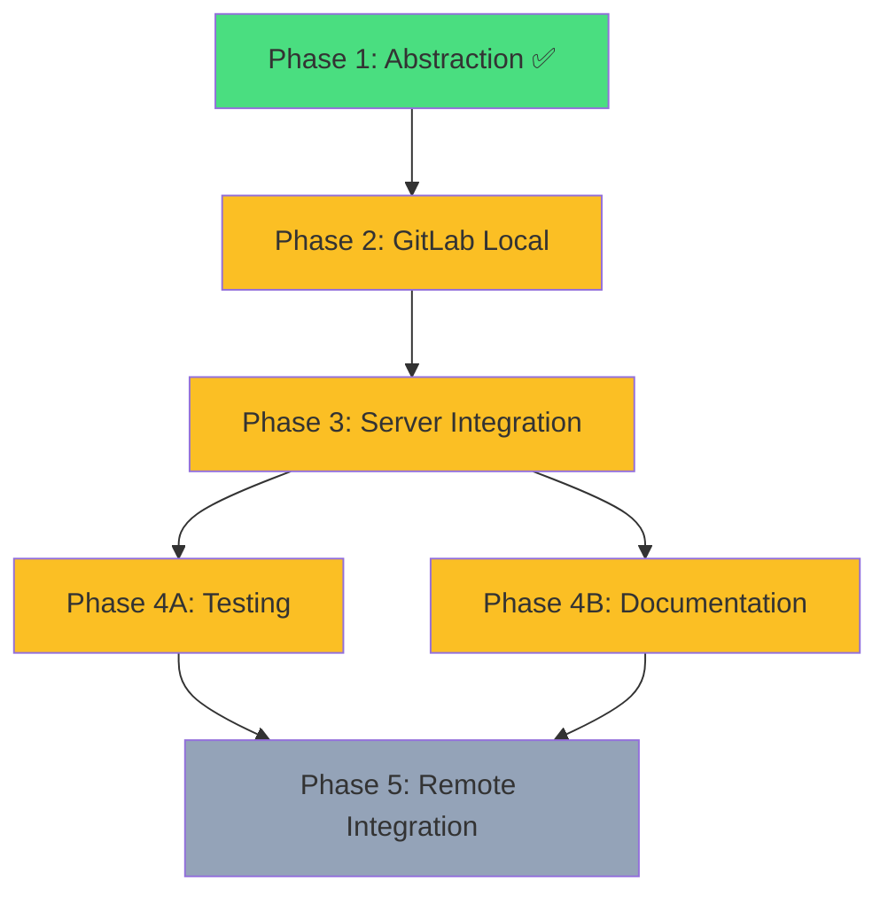

# Parallel Execution Plan - GitLab Support

## Current Status

✅ **Phase 1 Complete**: Provider abstraction layer implemented
- GitProvider trait defined
- GitHub refactored to implement trait
- Provider detection from URL working
- TypeScript types generated
- All tests passing

## Remaining Work Analysis

### Phase Dependencies



### Dependency Analysis

**Phase 2** (GitLab Local Support) - 4-5d
- **Blocks**: Phase 3, Phase 4, Phase 5
- **Blocked by**: Phase 1 ✅
- **Can run in parallel with**: Nothing (critical path)

**Phase 3** (Server Integration) - 2-3d
- **Blocks**: Phase 4
- **Blocked by**: Phase 2
- **Can run in parallel with**: Nothing (needs Phase 2 complete)

**Phase 4A** (Testing) - 1.5d
- **Blocks**: Phase 5
- **Blocked by**: Phase 3
- **Can run in parallel with**: Phase 4B

**Phase 4B** (Documentation) - 1d
- **Blocks**: Phase 5
- **Blocked by**: Phase 3 (needs working implementation to document)
- **Can run in parallel with**: Phase 4A

**Phase 5** (Remote Integration) - OPTIONAL - 5-7d
- **Blocks**: Nothing
- **Blocked by**: Phase 4A, Phase 4B
- **Can run in parallel with**: Nothing (final phase)

## Execution Strategy

### Sequential Execution (Current Plan)
Total time: **9-11 days** (excluding Phase 5)
```
Phase 2 → Phase 3 → Phase 4 (A+B together)
4-5d      2-3d       2-3d
```

### Optimal Parallel Execution
Total time: **8.5-10.5 days** (excluding Phase 5)
```
Phase 2 (blocking) → Phase 3 (blocking) → Phase 4A + 4B (parallel)
4-5d                 2-3d                  1.5d + 1d = 1.5d (max)
```

**Parallelization opportunity**: Phase 4A and 4B can run concurrently

## File Ownership Matrix

Prevents merge conflicts by assigning exclusive ownership of files to specific phases/agents.

### Phase 2: GitLab Local Support
**CREATES** (exclusive ownership):
- `crates/services/src/services/git_provider/gitlab.rs` ⚡️
- `crates/services/src/services/git_provider/gitlab/cli.rs` ⚡️
- `crates/services/src/services/git_provider/gitlab/api.rs` ⚡️
- `crates/services/src/services/git_provider/gitlab/types.rs` ⚡️

**UPDATES** (exclusive ownership):
- `crates/services/src/services/git_provider/mod.rs` (add GitLabProvider export) ⚡️
- `crates/services/src/services/git_provider/detection.rs` (return GitLab in factory) ⚡️

**READ ONLY**:
- `crates/services/src/services/git_provider/github.rs` (reference pattern)
- `crates/services/src/services/git_provider/types.rs` (use shared types)

### Phase 3: Server Integration
**CREATES** (exclusive ownership):
- `crates/server/src/routes/task_attempts/mr.rs` ⚡️
- `frontend/src/hooks/useGitProvider.ts` ⚡️
- `frontend/src/components/dialogs/auth/GlabCliSetupDialog.tsx` ⚡️

**UPDATES** (exclusive ownership):
- `crates/server/src/routes/task_attempts.rs` (register routes) ⚡️
- `crates/db/src/models/workspace.rs` (add git_provider field) ⚡️
- `frontend/src/components/dialogs/tasks/CreatePRDialog.tsx` ⚡️
- `frontend/src/components/dialogs/tasks/GitHubCommentsDialog.tsx` → rename ⚡️
- `frontend/src/lib/api.ts` (update endpoints) ⚡️

**READ ONLY**:
- `crates/services/src/services/git_provider/mod.rs` (use factory)
- `crates/services/src/services/git_provider/gitlab.rs` (call methods)

### Phase 4A: Testing
**CREATES** (exclusive ownership):
- `crates/services/tests/git_provider/detection_test.rs` ⚡️
- `crates/services/tests/git_provider/gitlab_test.rs` ⚡️
- `crates/services/tests/integration/gitlab_workflow_test.rs` ⚡️
- `frontend/src/components/dialogs/tasks/__tests__/CreatePRDialog.test.tsx` ⚡️
- `frontend/src/hooks/__tests__/useGitProvider.test.ts` ⚡️

**READ ONLY** (for testing):
- All Phase 2 and Phase 3 implementation files

### Phase 4B: Documentation
**CREATES** (exclusive ownership):
- `docs/gitlab-setup.md` ⚡️
- `docs/self-hosted-gitlab.md` ⚡️
- `docs/troubleshooting-git-providers.md` ⚡️
- `docs/api/merge-requests.md` ⚡️

**UPDATES** (exclusive ownership):
- `README.md` (add GitLab mention) ⚡️
- `docs/quickstart.md` (GitLab setup steps) ⚡️

**READ ONLY** (for documentation):
- All Phase 2 and Phase 3 implementation files

## Parallel Execution Instructions

### Wave 1: Phase 2 (BLOCKING - Must Complete First)
**Duration**: 4-5 days
**Agents**: 1 fullstack-developer

```bash
# Agent: fullstack-dev-gitlab-local
Task: Implement GitLab provider with CLI and REST API
Files: gitlab.rs, gitlab/cli.rs, gitlab/api.rs, gitlab/types.rs
Deliverable: GitLabProvider fully functional
```

**Exit Criteria**:
- ✅ GitLabProvider implements GitProvider trait
- ✅ `glab` CLI wrapper functional
- ✅ REST API client working (fallback)
- ✅ Self-hosted GitLab support enabled
- ✅ Provider factory returns GitLab for GitLab URLs
- ✅ Compiles successfully: `cargo check --workspace`

### Wave 2: Phase 3 (BLOCKING - Must Complete After Wave 1)
**Duration**: 2-3 days
**Agents**: 1 fullstack-developer

```bash
# Agent: fullstack-dev-server-integration
Task: Integrate both providers in server routes and frontend
Files: mr.rs, useGitProvider.ts, CreatePRDialog.tsx, api.ts
Deliverable: Unified endpoints working for both providers
```

**Exit Criteria**:
- ✅ Unified `/merge-request` endpoint functional
- ✅ Provider auto-detection working
- ✅ Frontend shows correct terminology (PR vs MR)
- ✅ TypeScript types regenerated successfully
- ✅ Existing GitHub workflows still working (backwards compatible)

### Wave 3: Phase 4 (PARALLEL - After Wave 2)
**Duration**: 1.5 days (max of both)
**Agents**: 2 fullstack-developers running in parallel

```bash
# Agent A: fullstack-dev-testing
Task: Comprehensive test coverage for all providers
Files: detection_test.rs, gitlab_test.rs, gitlab_workflow_test.rs, *.test.tsx
Deliverable: >80% test coverage, all tests passing
Duration: 1.5 days

# Agent B: fullstack-dev-documentation
Task: User-facing documentation for GitLab setup
Files: gitlab-setup.md, self-hosted-gitlab.md, troubleshooting-git-providers.md
Deliverable: Complete setup guides published
Duration: 1 day
```

**Exit Criteria (Agent A - Testing)**:
- ✅ 20+ URL pattern tests passing
- ✅ GitLab API client unit tests complete
- ✅ Integration test for MR creation flow working
- ✅ All existing GitHub tests still passing (regression proof)
- ✅ Test coverage report shows >80% for new code
- ✅ `cargo test --workspace` passes
- ✅ Frontend tests passing: `pnpm run test`

**Exit Criteria (Agent B - Documentation)**:
- ✅ `docs/gitlab-setup.md` complete with CLI and PAT setup
- ✅ `docs/self-hosted-gitlab.md` covers custom instances
- ✅ `docs/troubleshooting-git-providers.md` addresses common errors
- ✅ README.md updated with GitLab support
- ✅ API documentation created for new endpoints

## Wave Coordination

### Handoff Protocol

**Wave 1 → Wave 2**:
- Agent from Wave 1 MUST complete and run `cargo check --workspace`
- Agent from Wave 1 creates handoff report: `reports/wave1-completion.md`
- Wave 2 agent WAITS for confirmation before starting

**Wave 2 → Wave 3**:
- Agent from Wave 2 MUST complete and regenerate TypeScript types
- Agent from Wave 2 creates handoff report: `reports/wave2-completion.md`
- Wave 3 agents (A and B) WAIT for confirmation before starting
- Both Wave 3 agents can START SIMULTANEOUSLY once Wave 2 confirms completion

### Conflict Prevention

**No merge conflicts possible**:
- Each phase has exclusive ownership of created/modified files
- Phase 4A (testing) only creates test files
- Phase 4B (documentation) only creates doc files
- No shared files between Phase 4A and 4B

## Execution Commands

### For Main Orchestrator

```bash
# Wave 1
/cook fullstack-developer "Implement Phase 2: GitLab Local Support per plans/260101-1853-gitlab-support/phase-02-gitlab-local-support.md"

# Wait for Wave 1 completion, then Wave 2
/cook fullstack-developer "Implement Phase 3: Server Integration per plans/260101-1853-gitlab-support/phase-03-server-integration.md"

# Wait for Wave 2 completion, then Wave 3 in PARALLEL
/cook fullstack-developer "Implement Phase 4A: Testing per plans/260101-1853-gitlab-support/phase-04-testing-documentation.md Steps 1-5" &
/cook fullstack-developer "Implement Phase 4B: Documentation per plans/260101-1853-gitlab-support/phase-04-testing-documentation.md Steps 6-8" &
```

## Risk Mitigation

### Wave 1 Risks
**Risk**: `glab` CLI unreliable
**Mitigation**: REST API fallback implemented first, CLI wrapper second

**Risk**: Self-hosted GitLab version compatibility
**Mitigation**: Document minimum version (v13+), test against v13/v14/v15

### Wave 2 Risks
**Risk**: Breaking existing GitHub workflows
**Mitigation**: Keep `/github-pr` routes as aliases, extensive regression testing

**Risk**: Provider detection false positives
**Mitigation**: Comprehensive URL pattern tests from Phase 1

### Wave 3 Risks
**Risk**: Test flakiness in parallel execution
**Mitigation**: Mock external APIs, mark real API tests as `#[ignore]`

**Risk**: Documentation drift from implementation
**Mitigation**: Doc agent references implementation files directly, validates examples

## Success Metrics

### Time Savings
- Sequential: 9-11 days
- Parallel: 8.5-10.5 days
- **Savings**: 0.5-0.5 days (6% faster)

*Note*: Limited parallelization due to blocking dependencies. Main benefit is organizational clarity and conflict prevention.

### Quality Metrics
- Test coverage: >80% target
- Zero regressions in GitHub functionality
- Documentation completeness: 100% (all setup scenarios covered)
- Zero merge conflicts (file ownership enforced)

## Phase 5 Decision Point

After Wave 3 completion, evaluate if Phase 5 (Remote Integration - Webhooks & OAuth) is needed:

**Triggers for Phase 5**:
- User requests webhook automation
- Need for GitLab OAuth flow (vs PAT)
- Enterprise customer requires group-level tokens

**Defer Phase 5 if**:
- Current functionality sufficient for users
- No immediate webhook use cases
- Focus on stability and bug fixes first

## Next Steps

After parallel execution plan approval:
1. Orchestrator launches Wave 1 agent
2. Monitor Wave 1 progress
3. Upon Wave 1 completion, launch Wave 2 agent
4. Upon Wave 2 completion, launch Wave 3 agents (A + B) in parallel
5. Consolidate Wave 3 reports
6. Evaluate Phase 5 necessity

## Appendix: Agent Task Descriptions

### Agent: fullstack-dev-gitlab-local
**Input**: `plans/260101-1853-gitlab-support/phase-02-gitlab-local-support.md`
**Output**: GitLabProvider implementation, CLI wrapper, REST API client
**Validation**: `cargo check --workspace && cargo test --workspace --lib gitlab`

### Agent: fullstack-dev-server-integration
**Input**: `plans/260101-1853-gitlab-support/phase-03-server-integration.md`
**Output**: Unified server routes, frontend provider detection, UI updates
**Validation**: `cargo check && pnpm run check && pnpm run generate-types`

### Agent: fullstack-dev-testing
**Input**: Phase 4 Steps 1-5 (testing portion)
**Output**: Comprehensive test suite (unit + integration + frontend)
**Validation**: `cargo test --workspace && pnpm run test` with coverage >80%

### Agent: fullstack-dev-documentation
**Input**: Phase 4 Steps 6-8 (documentation portion)
**Output**: User guides, troubleshooting docs, API documentation
**Validation**: All markdown files lint-clean, examples validated

## Unresolved Questions

1. **Phase 5 scope**: Should we defer or proceed immediately after Phase 4?
2. **CI integration**: Should parallel test execution be mirrored in CI?
3. **Agent communication**: How do Wave 3 agents coordinate if issues found?
4. **Rollback strategy**: If Wave 2 fails, how to roll back Wave 1 changes?
5. **Performance benchmarks**: Should we add MR creation time benchmarks in Phase 4A?
